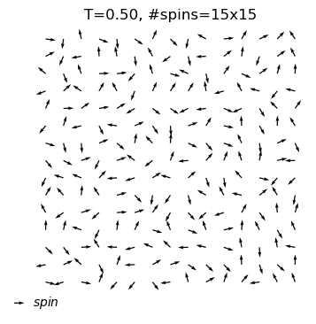

# XY-MODEL
Monte Carlo simulation (Metropolis algorithm) on 2D XY-model


## How to use this program

#### import the class 


```python
from XY_model import XYSystem
```

#### creating an object as a X-Y spin system with given width and temperature

Use `XYSystem(temperature = 0.5, thetas = thetas , width = )` to creat a class object. Two variables can be assigned to initilize the system: the temperature and the width.


```python
from scipy.stats import truncexpon
support_limit = 10
num_spots = 256
thetas = truncexpon.rvs(b=support_limit, size=num_spots)
xy_system_1 = XYSystem(temperature  = 0.5, thetas, support_limit)
```

#### visulizingthe spin system

using `.show()` to visulize the xy spin system as arrows on two-dimensional plane.


```python
xy_system_1.show()
print('Energy per spin:%.3f'%xy_system_1.energy)
```





    Energy per spin:0.056
    

#### Now, let the system evolve to a equilibrium state

> `self.equilibrate(self,max_nsweeps=int(1e4),temperature=None,H=None,show = False)` allows you to assign a new temperature, just simply do object.equilibrate(temperature = 3). If you want to keep the temperature defined before, leave it blank. And ·sohw=Ture` will let show the configuration of the system for each 1000 sweeps.


```python
xy_system_1.equilibrate(show=True)
xy_system_1.show()
```

    #sweeps=1
    energy=-0.60
    


    
    equilibrium state is reached at T=0.5
    #sweep=504
    energy=-1.72
    


#### Observing the thermal quantities in different temperature - annealing approach


```python
xy_system_2 = XYSystem(width=7)
cool_dat=xy_system_2.annealing(T_init=2.5,T_final=0.1,nsteps = 10,show_equi=True)
```

    
    equilibrium state is reached at T=2.5
    #sweep=6802
    energy=-0.48
    


    
    equilibrium state is reached at T=2.2
    #sweep=3429
    energy=-0.48
    


    
    equilibrium state is reached at T=2.0
    #sweep=9999
    energy=-0.47
    


    
    equilibrium state is reached at T=1.7
    #sweep=2809
    energy=-0.60
    


    
    equilibrium state is reached at T=1.4
    #sweep=989
    energy=-0.74
    


    
    equilibrium state is reached at T=1.2
    #sweep=2253
    energy=-1.35
    


    
    equilibrium state is reached at T=0.9
    #sweep=636
    energy=-1.68
    


    
    equilibrium state is reached at T=0.6
    #sweep=837
    energy=-1.72
    


    
    equilibrium state is reached at T=0.4
    #sweep=548
    energy=-1.86
    


    
    equilibrium state is reached at T=0.1
    #sweep=503
    energy=-1.95
    


Install packages:
```
python -m pip install -U matplotlib
```